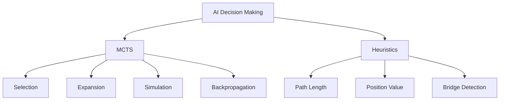
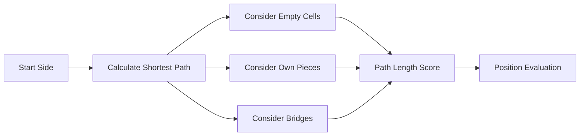
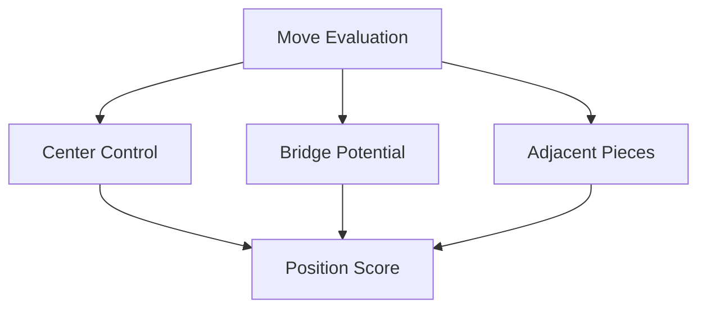
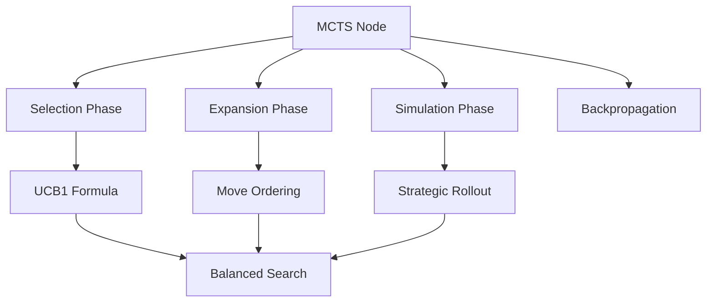

# Hex Game AI Heuristics Documentation

## Table of Contents
- [Overview](#overview)
- [Core Heuristics](#core-heuristics)
  - [Path Length Evaluation](#path-length-evaluation)
  - [Position Assessment](#position-assessment)
  - [Monte Carlo Tree Search Integration](#monte-carlo-tree-search-integration)
- [Implementation Details](#implementation-details)
- [Strategy Components](#strategy-components)

## Overview

This document details the heuristic approaches used in our Hex game AI implementation. The AI combines Monte Carlo Tree Search (MCTS) with several domain-specific heuristics to create a strong and efficient player.



## Core Heuristics

### Path Length Evaluation

The primary heuristic evaluates positions by calculating the shortest possible path between a player's sides of the board.



Key components:
1. **Path Finding**: Recursive depth-first search to find shortest connection
2. **Bridge Integration**: Considers bridge formations as potential path components
3. **Scoring**: Lower path lengths indicate better positions

Example code:
```java
public double calcVal(int[][] board) {
    int opp = aiplayer==1 ? 2 : 1;
    minLen = 49;
    double maxno = 999;
    
    for (int i=0; i<board.length; i++) {
        if (board[i][0]!=opp) {
            int initCountO = board[i][0]==opp ? 0 : 1;
            Location oLoc = aiplayer==1 ? 
                          new Location(0, i) : 
                          new Location(i, 0);
            double no = (double)calcN(board, opp, oLoc, 
                       new ArrayList<Location>(), initCountO);
            minLen = 49;
            maxno = Math.min(maxno, no);
        }
    }
    return maxno;
}
```

### Position Assessment

The AI evaluates move quality based on several factors:



1. **Center Control**
   - Prefers moves closer to board center
   - Calculated using Manhattan distance
   ```java
   score -= Math.abs(3 - move.x) + Math.abs(3 - move.y);
   ```

2. **Bridge Potential**
   - Evaluates possibility of forming bridges
   - Bridge pattern:
   ```
   O   O
    \ /
     X
    / \
   O   O
   ```
   Where:
   - O: Empty cells
   - X: Current piece
   - \: Connection path

3. **Adjacent Piece Consideration**
   - Values moves that connect to existing pieces
   - Used in fallback strategy

### Monte Carlo Tree Search Integration

The heuristics are integrated into the MCTS framework:



Key integration points:

1. **Node Selection (UCB1)**
```java
double exploitation = child.wins / child.visits;
double exploration = Math.sqrt(2 * Math.log(this.visits) / child.visits);
double ucb1 = exploitation + exploration;
```

2. **Strategic Rollout**
```java
// 30% chance for strategic move in simulation
if (Math.random() < 0.3) {
    // Use heuristic evaluation
    move = getBestStrategicMove(moves, board);
} else {
    // Random move
    move = moves.get((int)(Math.random() * moves.size()));
}
```

## Implementation Details

### Time Management
- Simulation time limit: 1000ms per move
- Maximum simulation depth: 10 moves
- Maximum children per node: 7

### Move Selection Process
1. Calculate heuristic values for all legal moves
2. Sort moves by potential value
3. Apply MCTS with time constraint
4. Select best move based on visit count and win rate

### Fallback Strategies
1. Try to play adjacent to opponent's last move
2. Take center if available
3. Take first legal move if all else fails

## Strategy Components

### Opening Strategy
- First move: Always play center (optimal in Hex)
- Early game: Focus on center control

### Midgame Strategy
- Bridge building and prevention
- Path creation and blocking
- Territory control

### Endgame Strategy
- Path completion
- Forced move detection
- Win condition verification

This comprehensive set of heuristics allows the AI to:
1. Make strong moves even with limited calculation time
2. Balance different strategic considerations
3. Adapt to various game situations
4. Maintain competitive play throughout the game

The implementation achieves this while staying within the 5-minute total game time constraint, making it suitable for tournament play.
